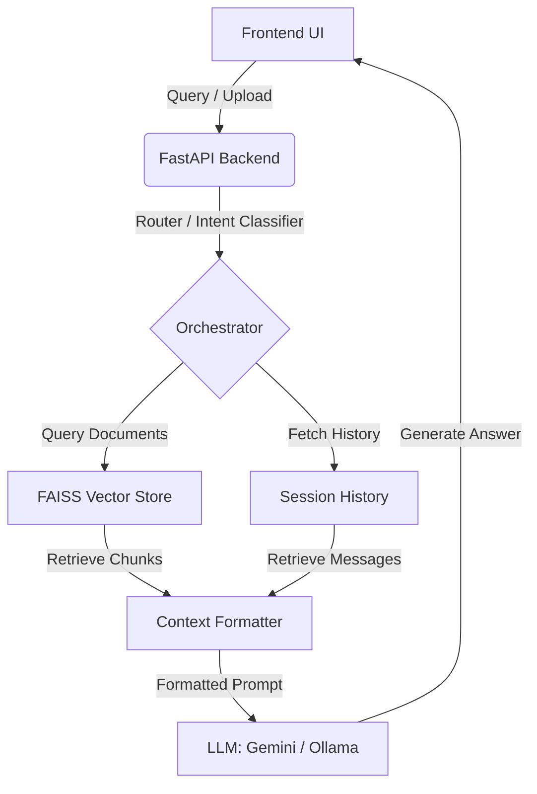

# 🧠 MindVault

MindVault is a state-of-the-art, fully local Retrieval-Augmented Generation (RAG) system. It allows users to securely upload documents, index them using highly efficient vector embeddings, and interact with their content through a beautiful, modern chat interface. 

MindVault is built for privacy and performance, supporting both **fully local LLM pipelines** (via Ollama) and **cloud-scale pipelines** (via Google Gemini).

---

## 🚀 Key Features

- **Dual-Model Support**: Run completely offline using Ollama (`llama3.2:3b` and `nomic-embed-text`) or scale up with Google Gemini API integrations.
- **Intelligent Query Routing**: An orchestrator automatically classifies query intent (`answer`, `summarize`, `compare`, `test`) and determines whether to fetch context from documents or use conversation history.
- **Customized Persona RAG Modes**: Toggle between different system behaviors:
  - 🎓 **Student Mode**: Simplified explanations with clear bullet points.
  - ⚖️ **Lawyer Mode**: Highly formal, precise answers, flagging ambiguities.
  - 💻 **Developer Mode**: In-depth implementation details and code snippets.
  - ⚙️ **Default Mode**: Direct, factual context extraction.
- **Interactive Quizzes & Comparisons**: Automatically generates MCQs/short-answer tests or concept-comparison tables from your documents.
- **Robust Document Management**: Upload, list, and delete documents with automatic vector-chunk purging from FAISS indices.
- **Premium User Interface**: A modern, responsive React + TypeScript dashboard with dark-mode styling and micro-animations.

---

## 🛠️ Tech Stack

### Backend
- **FastAPI**: High-performance, asynchronous web framework.
- **LangChain**: AI orchestration for prompts, chains, and memory.
- **Ollama**: Hosting local models (`llama3.2:3b`, `nomic-embed-text`).
- **FAISS (CPU)**: Lightweight, fast local vector storage.
- **SQLite / PostgreSQL**: Local auth databases storing user accounts.

### Frontend
- **React 19 & Vite**: Ultra-fast hot-reloading frontend development environment.
- **TypeScript**: Full type safety.
- **Lucide React**: Premium icon suite.

---

## 📋 System Architecture



---

## ⚙️ Quick Start

### 1. Prerequisites
Ensure you have the following installed:
- Python 3.10+
- Node.js 18+
- [Ollama](https://ollama.com/) (For local offline execution)

If running locally with Ollama, download the required models:
```bash
ollama pull llama3.2:3b
ollama pull nomic-embed-text
```

### 2. Backend Setup
1. Navigate to the backend directory:
   ```bash
   cd backend
   ```
2. Create and activate a Python virtual environment:
   ```bash
   python -m venv venv
   # Windows:
   .\venv\Scripts\Activate.ps1
   # macOS/Linux:
   source venv/bin/activate
   ```
3. Install dependencies:
   ```bash
   pip install -r ../requirements.txt
   ```
4. Create a `.env` file inside the `backend/` directory:
   ```env
   OLLAMA_BASE_URL=http://localhost:11434
   GEMINI_API_KEY=your_gemini_api_key_here
   ```
5. Start the FastAPI development server:
   ```bash
   uvicorn app:app --reload
   ```
   *The backend will run on `http://localhost:8000`. You can access interactive API documentation at `http://localhost:8000/docs`.*

### 3. Frontend Setup
1. Navigate to the frontend directory:
   ```bash
   cd ../frontend
   ```
2. Install npm packages:
   ```bash
   npm install
   ```
3. Create a `.env` file inside the `frontend/` directory:
   ```env
   VITE_API_URL=http://localhost:8000
   ```
4. Start the frontend server:
   ```bash
   npm run dev
   ```
   *The client dashboard will be available at `http://localhost:3000`.*

---

## 📂 Project Structure

```
mindwault/
├── backend/
│   ├── auth/              # JWT & password utilities
│   ├── data/              # SQLite DB, uploads, and registries
│   ├── database/          # Database connection & auth tables
│   ├── metadata/          # Document trackers
│   ├── rag/               # Core RAG, vectorstores & retrieval chains
│   └── app.py             # FastAPI entrypoint
├── frontend/
│   ├── src/
│   │   ├── components/    # ChatTab, UploadTab, DashboardTab
│   │   ├── App.tsx        # Main application layout
│   │   └── index.css      # Core styles & Tailwind-free aesthetics
│   └── package.json       # Node package manager configuration
├── requirements.txt       # Backend dependencies
└── README.md              # This file
```

---

## 🔒 Security & Privacy
Because MindVault runs locally by default:
- Your uploaded documents never leave your machine when using the Ollama provider.
- User authentication passwords are hashed using secure Argon2id/Bcrypt configurations locally.
